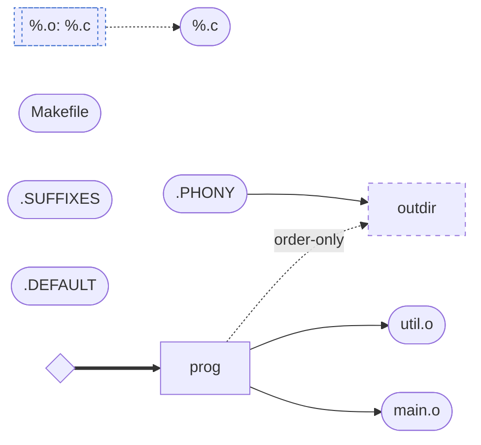
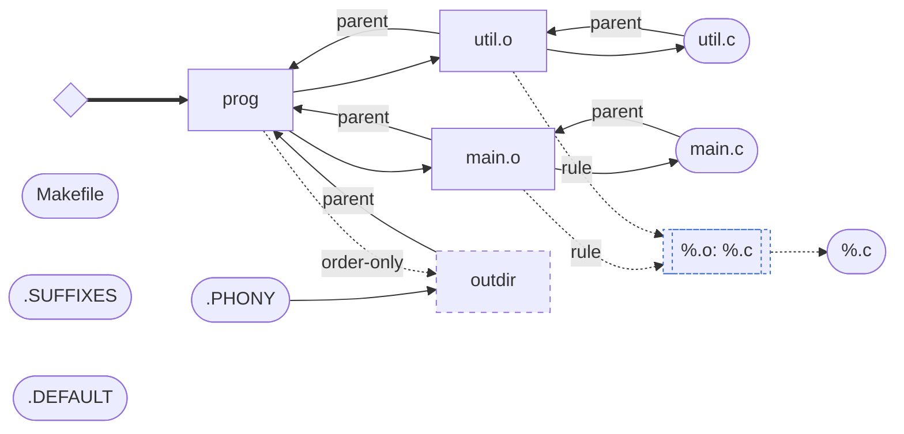

# Dependency graph of a real makefile

<!-- Generated by tests/depgraph_dump.rs (makefile_snapshot_doc_is_current). -->
<!-- Regenerate with: UPDATE_SNAPSHOTS=1 cargo test --test depgraph_dump -->

Dumped by the real `make` binary via
`MAKERS_DEPGRAPH=graph.md MAKERS_DEPGRAPH_POST=post.md make -rn`
from this makefile (`tests/fixtures/depgraph.mk`):

```make
# Fixture for the MAKERS_DEPGRAPH end-to-end test (tests/depgraph_dump.rs):
# a real makefile exercising an explicit link rule, a user-defined pattern
# rule, and an order-only prerequisite on a phony target.
prog: main.o util.o | outdir
	cc -o $@ main.o util.o

%.o: %.c
	cc -c -o $@ $<

.PHONY: outdir
outdir:
	mkdir -p outdir
```

## Before the update walk

What make knows after reading makefiles — plain prerequisites and the
rule database; implicit-rule matching has not run yet:



## After the update walk

The resolved graph: pattern matching derived `main.o`/`util.o` from
their sources, and each object carries a `rule` provenance edge to the
`%.o: %.c` rule that built it:


