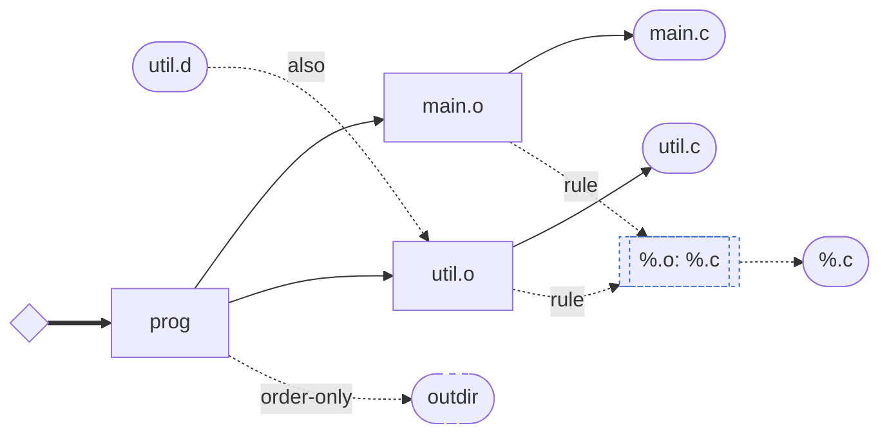

# Dependency graph — sample visualization

<!-- Generated by the `depgraph::tests::mermaid_snapshot_doc_is_current` test. -->
<!-- Regenerate with: UPDATE_SNAPSHOTS=1 cargo test --lib depgraph -->

The showcase graph from `src/depgraph.rs`: `prog` linked from two
objects, each derived from its source by the `%.o: %.c` pattern rule
(dotted `rule` edges are provenance), with a phony order-only
`outdir` prerequisite and a `util.d` sibling produced by the same
recipe as `util.o` (`also` edge).

